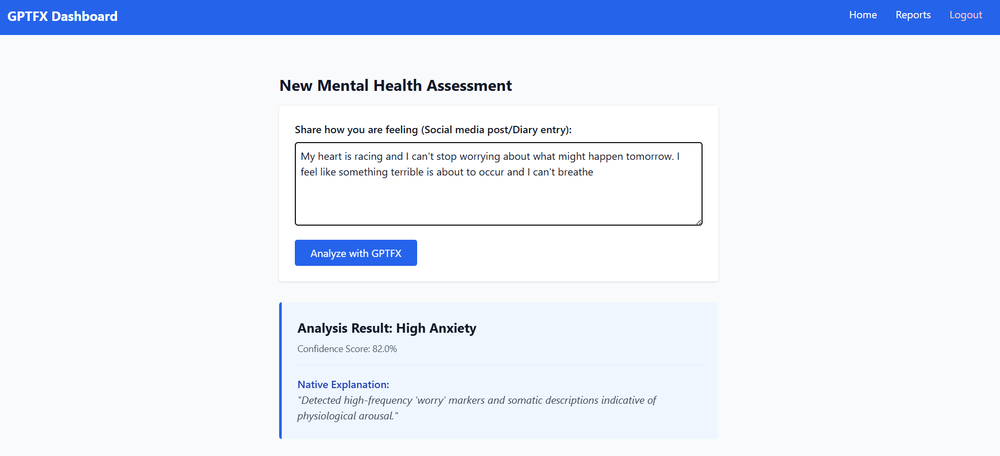
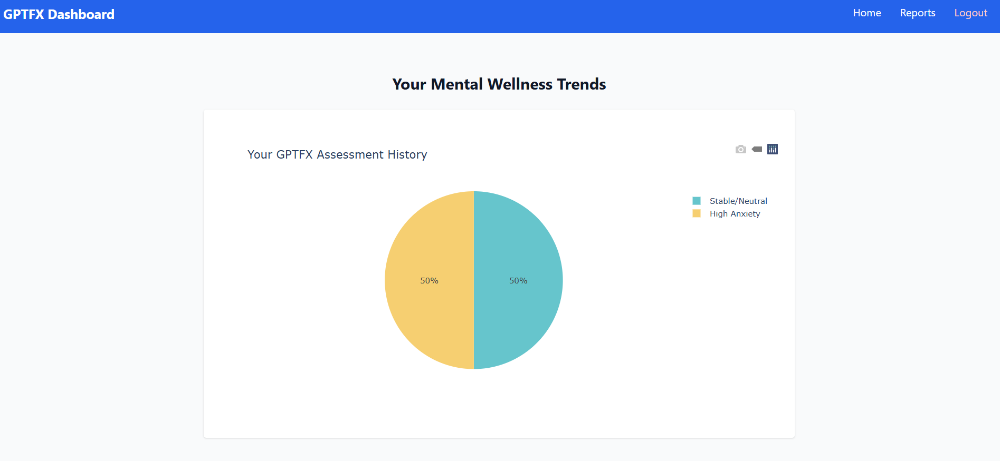

# GPTFX - Mental Health Detection Framework

## Overview

GPTFX is a GPT-3 based Explainable AI framework designed for mental health detection using textual analysis. The system identifies possible mental health conditions from user-generated text and provides human-readable explanations for predictions.

The project combines Natural Language Processing (NLP), Machine Learning, and Explainable AI techniques to improve transparency, interpretability, and clinical usability in mental health assessment systems.

---

## Live Demo

https://gptfx-mental-health-detection-1.onrender.com/

---

## Features

- Mental health prediction using GPT-3
- Explainable AI based reasoning
- Human-readable prediction explanations
- User-friendly web interface
- Flask-based backend system
- Textual sentiment and context analysis
- Secure database integration
- Scalable cloud-ready deployment

---

## Research Contribution

GPTFX introduces a unified framework that combines GPT-3 based mental health prediction with native explainability.

### Key Contributions

- Integration of prediction and explanation within a single framework
- Human-readable explanation generation for predictions
- Context-aware mental health analysis using GPT-3
- Improved transparency compared to traditional black-box models
- Enhanced trust and interpretability for users and clinicians

Unlike conventional systems that only provide classification outputs, GPTFX explains the reasoning behind predictions using contextual language understanding.

---

## Technologies Used

### Frontend
- HTML5
- CSS3

### Backend
- Python
- Flask

### Database
- SQLite

### Artificial Intelligence and NLP
- GPT-3 API
- Machine Learning
- Natural Language Processing (NLP)

### Deployment
- Render

---

## System Architecture

The GPTFX framework follows a layered architecture consisting of:

1. User Interaction Layer
2. Web Application Layer
3. AI Processing Layer
4. Output Layer
5. Database Layer

### Workflow

- User enters textual input
- Flask application processes the request
- GPT-3 analyzes emotional and contextual patterns
- Mental health prediction is generated
- Explainable AI module generates reasoning
- Results are displayed to the user
- Data is securely stored in the database

---

## Project Structure

```bash
GPTFX/
│
├── templates/
│   ├── index.html
│   ├── dashboard.html
│   ├── login.html
│   ├── register.html
│   ├── layout.html
│   └── reports.html
│
├── app.py
├── requirements.txt
├── gptfx_mental_health.db
├── README.md
└── architecture.png
```

---

## Installation and Setup

### Clone Repository

```bash
git clone https://github.com/Asritha08-lab/GPTFX-Mental-Health-Detection.git
```

### Navigate to Project Directory

```bash
cd GPTFX-Mental-Health-Detection
```

### Install Dependencies

```bash
pip install -r requirements.txt
```

### Run Application

```bash
python app.py
```

---

## Deployment

The project is deployed using Render.

### Deployment Platform
- Render Cloud Platform

### Live Deployment Link
https://gptfx-mental-health-detection-1.onrender.com/

---

## Privacy and Ethics

- User data is anonymized before processing
- Secure database handling is implemented
- The framework emphasizes ethical AI practices
- The system is designed for supportive analysis and not as a replacement for professional medical diagnosis

---

## Future Scope

- Real-time counseling chatbot integration
- Multi-language mental health analysis
- Emotion trend visualization
- Clinical support system integration
- Advanced explainability modules
- Mobile application deployment

---

## Application Preview

### Login Page


### Home Page



### Prediction Result Page



---

---

## Author

Asritha Nalubala

---

## License

All Rights Reserved.

This project and its source code may not be copied, modified, or distributed without permission from the author.
